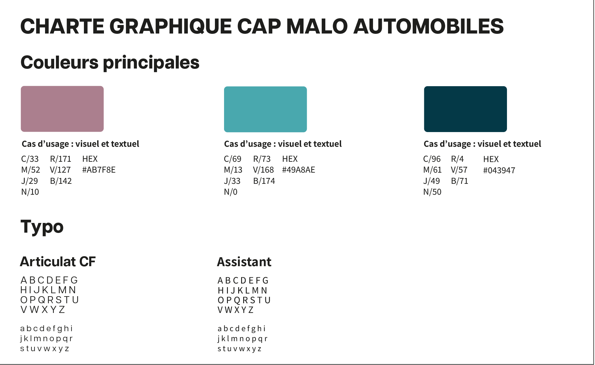

# Test UI/UX tec3h

## Mise en place
Téléchargez le projet sur github en utilisant le lien suivant : [https://github.com/mathiaswandel/ui_ux_test_tec3h](https://github.com/mathiaswandel/ui_ux_test_tec3h) ou en clonant le projet avec la commande suivante :
```bash
git clone https://github.com/mathiaswandel/ui_ux_test_tec3h
```
Une fois que vous avez terminé vos modifications, vous pouvez nous envoyer votre travail en compressant le projet et en nous l'envoyant par email à l'adresse suivante : [mathiasw@tec3h.fr](mailto:mathiasw@tec3h.fr)

## Contexte
Vous êtes un développeur front-end chez tec3h, une entreprise de développement web. Vous avez été assigné à un projet de développement d'un site web pour une entreprise de vente de voitures d'occasion. L'objectif du site web est de permettre aux internautes d'en apprendre d'avantage sur l'entreprise, de consulter les voitures disponibles à la vente et de prendre contact avec l'entreprise pour obtenir plus d'informations.

Un développeur amateur a commencé à travailler sur le projet, mais il a abandonné avant de terminer. Il a laissé derrière lui un prototype de site, mais il manque plusieurs éléments et le design est catastrophique. Votre mission est de reprendre le travail là où il s'est arrêté et de terminer la page d'accueil du site à l'aide de la charte graphique fournie par le client, afin de livrer un site web fonctionnel et esthétique.

## Consignes

Voici la charte graphique du projet (`charte_graphique.png` à la racine du projet).


1. Reprenez le travail là où le développeur amateur s'est arrêté.
2. Vous devez terminer le projet en respectant la charte graphique fournie par l'entreprise.
3. Le design de l'application doit être responsive et s'adapter aux écrans de toutes tailles.
4. Vous avez le droit d'utiliser des librairies CSS (Bootstrap, Tailwind CSS, etc.) pour vous aider.
5. Vous avez le droit d'utiliser des librairies JavaScript (jQuery, etc.) pour vous aider.
6. Vous avez le droit d'utiliser des images externes pour remplacer les images présentes dans le prototype si vous le souhaitez.
7. Le CSS sera la partie la plus importante et modifiée du projet, cependant vous pouvez modifier le HTML et revoir la structure du projet si vous le jugez nécessaire.
8. N'hésitez pas à ajouter des fonctionnalités/animations et proposer des idées supplémentaires au client si vous le souhaitez.

## Bonne chance !
```